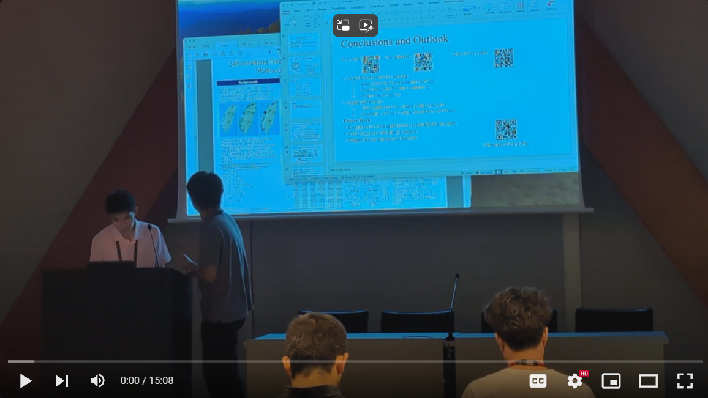

# Current Research
Below is a list of research projects I have previously worked on. I'm currently working on a visualization system for **V**ision **L**anguage **M**odels to aid people who may be visually/hearing impaired in navigating new environments.

# Past Papers
- Zhiqiang Jiang, **Isaac Huang**, Xin Wang. 2024. *IndoorRoaming: An LLM-based System for Indoor Tour Guidance*. The 4th ACM SIGKDD Workshop on Deep Learning for Spatiotemporal Data, Applications, and Systems (DeepSpatial 2024), Barcelona, Spain, Aug 26, 2024.   Here's a video of the presentation and a [**link**](assets/DeepSpatial24_paper.pdf) to our paper.   
